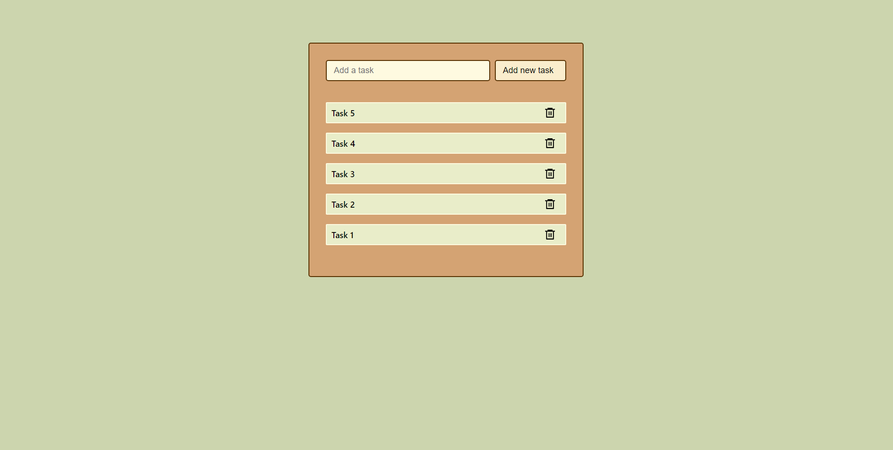
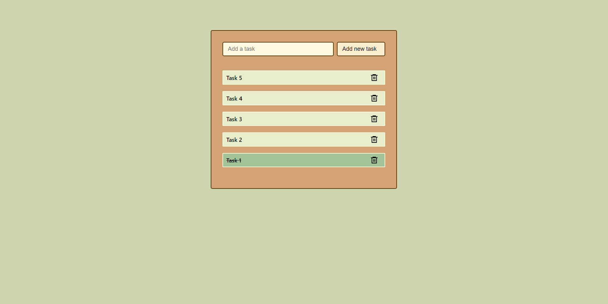

# TO-DO list challenge

This is a TO-DO list challenge to put my react skills into practice.

## Table of contents

- [Overview](#overview)
  - [The challenge](#the-challenge)
  - [Screenshot](#screenshot)
  - [Links](#links)
- [My process](#my-process)
  - [Built with](#built-with)

## Overview

### The challenge

Users should be able to:

- Add tasks
- Mark tasks as completed
- Delete done tasks

### Screenshot

### Links

- Live Site URL: [GitHub porject page](https://manugil22.github.io/to-do-list/)

## My process

### Built with

- Semantic HTML5 markup
- CSS custom properties
- Flexbox
- React
